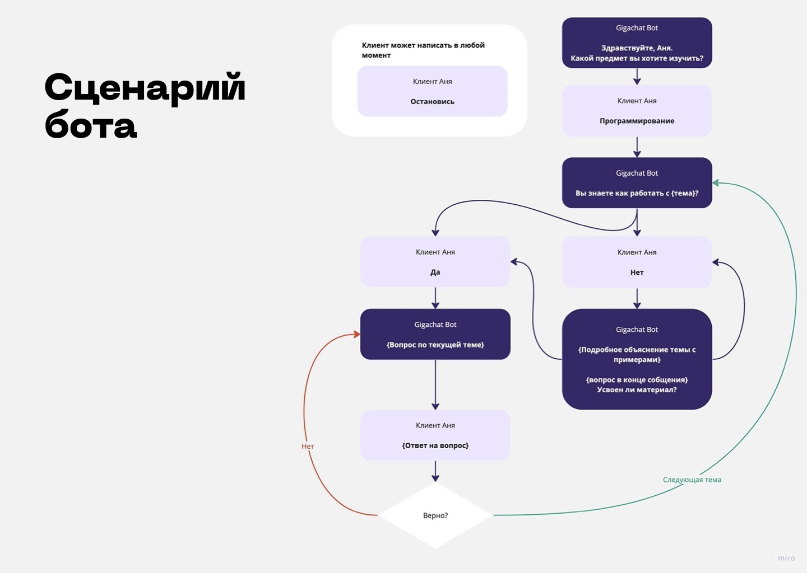

# Решение команды Mountaind Heads для хакатона Phystech GigaChat Challenge

Sozvon.pro — платформа, которая облегчает экспертам взаиморасчёты с клиентами за проведённые онлайн-консультации. Для клиентов сервис — удобный инструмент для поиска эксперта, общения с ним и оплаты — всё это происходит на одной платформе.

По ссылке [cссылке](sozvon_prez.pdf) можно изучить подробную презентацию сервиса

Реализовали в рамках хакатона в сервисе sozvon.pro:
- чат с ботом-экспертом. Бот сам пишет новому пользователю, спрашивает о его целях на платформе, присылает ему тесты и задачки. 
- генерацию текста и картинок для постов в разделе “Блоги”.

## AI репетитор, который по сценарию и взаимодействию с Gigachat обучает пользователей программированию

Видео демонстрирует работу бота и возможность быстрой авторизации.

По ссылке [cссылке](chat_bot.js) можно ознакомиться с кодом, который отвечает за поведение бота.
## AI помощник для написания стайте и генерации картинок

Видео демонстрация работы AI помощника по написанию статей и возможность быстрой авторизации в роли эксперта через ссылку.
[cссылка](https://sozvon.pro/create_blog_post?token=dZQs8EmuTrOUixSggg831685183100270) - cссылка для быстрого тестирования написания статей

